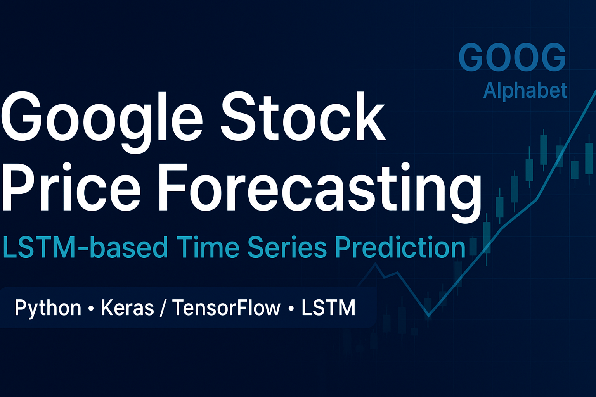

<p align="center">
  
</p>

# 📈 Google Stock Price Forecasting Using LSTM  
*A Deep Learning Approach to Time-Series Prediction*

<p align="center">
  
  
  
  
</p>

---

## 🧠 Overview

This project demonstrates how to build and evaluate a **Long Short-Term Memory (LSTM)** deep learning model to forecast the closing price of **Google (GOOGL)** stock.

The notebook walks through a full, production-style time-series pipeline — including data loading, preprocessing, model training, evaluation, and visualization.

The purpose of the project is to explore the effectiveness of recurrent neural networks in financial time-series analysis and trend forecasting.

---

## 🎯 Objectives

- Load and visualize historical Google stock market data  
- Prepare time-series sequences suitable for LSTM networks  
- Build and train an LSTM model using TensorFlow/Keras  
- Evaluate predictions using **RMSE**
- Plot actual vs. predicted values  
- Discuss limitations and future improvements  

---

## 📂 Project Structure

| File/Folder                        | Description                                                                 |
|------------------------------------|----------------------------------------------------------------------------- |
| `dataset/`                         | Google stock price dataset                          |
| `assets/`                          | Stores generated plots, graphs, visualizations and thumbnails (e.g., predicted vs. actual stock prices) |
| `.gitignore`                       | Specifies files and directories to ignore in Git                            |
| `LICENSE`                          | MIT License file                                                            |
| `README.md`                        | Documentation with project overview, objectives, and usage                  |
| `google_stock_price_forecast_lstm.ipynb` | Jupyter Notebook with the full pipeline: preprocessing, LSTM model training, evaluation, and visualization |
| `requirements.txt`                 | Python dependencies required to run the project                             |


---

## 🛠️ Technologies Used

- **Python 3.8+**
- **TensorFlow / Keras**
- **Pandas**
- **NumPy**
- **Matplotlib**
- **Seaborn**
- **Scikit-learn**

---

## 🧠 Model Architecture

The LSTM forecasting model uses a stacked recurrent architecture:

- Input Layer
  - The model takes sequences of past 60 days of normalized closing price data (window length), forming the input shape (sequence_length, 1).
- LSTM Layers
  - First LSTM layer
    - Units: 60
    - return_sequences=True, so that it outputs a full sequence to the next LSTM.
    - Activation: typically tanh (default) for LSTM.
    - Dropout: e.g., Dropout(0.2) to regularize and reduce overfitting.
  - Second LSTM layer
    - Units: 60
    - return_sequences=True
    - Activation: tanh
    - Dropout: 0.2
  - Third LSTM layer
    - Units: 60
    - return_sequences=False
    - Activation: tanh
    - Dropout: 0.2
- Dense Output Layer
  - After the LSTM layers, there's a fully connected (Dense) layer with 1 neuron, producing the forecast for the next day's closing price.
  - Activation: linear, as this is a regression task.
- Compilation
  - Loss Function: Mean Squared Error (MSE) — well-suited for regression and time-series prediction.
  - Optimizer: Adam — commonly used for its good convergence behavior.


- **Optimizer:** Adam  
- **Loss Function:** Mean Squared Error (MSE)  
- **Output:** Next-day closing price prediction  

### Model Summary

| Layer (type) | Output Shape   | Param # |
| ------------ | -------------- | ------- |
| LSTM         | (None, 60, 60) | 14880   |
| Dropout      | (None, 60, 60) | 0       |
| LSTM         | (None, 60, 60) | 29040   |
| Dropout      | (None, 60, 60) | 0       |
| LSTM         | (None, 60)     | 29040   |
| Dropout      | (None, 60)     | 0       |
| Dense        | (None, 1)      | 61      |

- Total params: 72,021
- Trainable params: 72,021
- Non-trainable params: 0

---

## 📉 Model Performance

The notebook computes the following metrics using **inverse-transformed predictions** (in USD):

| Metric | Value |
|--------|-------|
|**RMSE**| 10.65 |

These metrics provide insight into how closely the model tracks real stock movements.

---

## 📈 Visualizations

The notebook includes several informative visualizations:

### ✔ Actual vs. Predicted Prices  
A direct comparison of model output vs. true values.


### ✔ Training Loss Curve  
Displays convergence behavior during model training.


---

## 🔍 Key Insights

- LSTM networks can effectively learn temporal dependencies in stock price data.  
- Predictions track major trends but are limited by market volatility.  
- Scaling data and proper sequence windowing improve model performance.  
- A single-feature (closing price only) model provides reasonable baseline accuracy.

---

## ⚠️ Limitations

- Stock prices are influenced by many external factors not included in the dataset.  
- Deep learning cannot compensate for unpredictable market events.  
- Only closing prices were used — no volume, indicators, or sentiment inputs.  
- Long-term forecasting is significantly less accurate than short-term.

---

## 🚀 Future Improvements

Planned enhancements or ideas for extension:

- Add technical indicators (RSI, MACD, Bollinger Bands)  
- Include news sentiment or macroeconomic features  
- Use other architectures (GRU, Transformer, Temporal Convolutional Networks)  
- Apply hyperparameter tuning (Optuna, KerasTuner)  
- Perform multi-step forecasting (predict multiple days ahead)  
- Implement walk-forward/rolling-window cross-validation  

---

## ▶️ How to Run

### 1️⃣ Clone the repository
```bash
git clone https://github.com/yourusername/google-stock-lstm-forecast.git
cd google-stock-lstm-forecast
```

### 2️⃣ Install dependencies
```bash
pip install -r requirements.txt
```

### 3️⃣ Launch the notebook
```bash
jupyter notebook google_stock_lstm_forecast.ipynb
```

---

## 📦 Data Source

The data used for training and evaluating the forecasting model comes from the publicly available dataset **“Gooogle Stock Price”** on Kaggle. The dataset was published by user **rahulsah06**.  
[View Dataset on Kaggle](https://www.kaggle.com/datasets/rahulsah06/gooogle-stock-price)

### Dataset Description
- Historical daily stock prices for Alphabet Inc. (GOOG), including:
  - Open, High, Low, Close, and Volume
- Data is in CSV format and is suitable for time-series modeling.

### How It Was Used
- The “Close” price column was extracted and normalized to feed into the LSTM forecasting model.
- Time windows of 60 past trading days were used to predict the next-day closing price.

### Attribution
If you reuse or redistribute this data, please attribute the original dataset:

> "Gooogle Stock Price" by rahulsah06, available on Kaggle: [https://www.kaggle.com/datasets/rahulsah06/gooogle-stock-price](https://www.kaggle.com/datasets/rahulsah06/gooogle-stock-price)

---

## 📜 License

This project is provided under the [MIT License](LICENSE).
Feel free to use, modify, and distribute for personal or educational purposes.

---

## 🙏 Acknowledgements

I would like to express my gratitude to everyone who supported and contributed — directly or indirectly — to this project:

- I thank the author of the dataset Google Stock Price (user “rahulsah06” on Kaggle) for publishing the historical stock-price data, which forms the basis of this entire analysis. ([GitHub Repository](https://github.com/ArianJr/google-stock-price-forecasting-lstm))  
- I acknowledge the developers and maintainers of the open-source libraries used in this project: TensorFlow / Keras for enabling the LSTM model implementation; Pandas and NumPy for data manipulation; and Matplotlib / Seaborn for visualization — without these tools this work would not have been possible.  
- I appreciate the users and the community of GitHub for providing a collaborative platform that encourages sharing, improvement, and distribution of open-source data science projects.  
- Finally, I thank anyone who has reviewed, given feedback, or simply followed this project — your interest and input motivate the continued development and improvement of this work.

---

## 🤝 Contributions

Contributions, suggestions, and improvements are always welcome!
Feel free to open an issue or submit a pull request.

---

## 👤 Author

**Arian Jr**  
📧 [Contact Me](arianjafar59@gmail.com) • 🌐 [GitHub Profile](https://github.com/ArianJr)

---

<p align="center">
  Made with ❤️ by <a href="https://github.com/ArianJr" target="_blank">ArianJr</a>
</p>

<p align="center">
  <sub>⭐ If you found this project useful, please consider giving it a star! It helps others discover it and supports my work.</sub>
</p>
